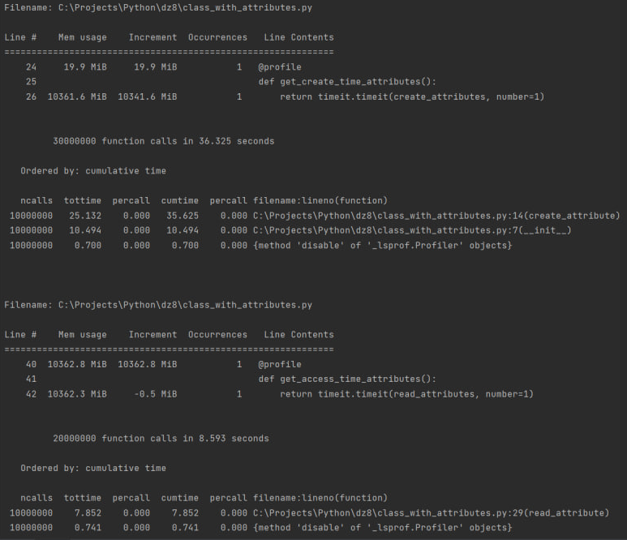

Использование классического класса с атрибутами:

+Удобство

+Можно добавлять новые атрибуты

-Затраты времени

-Затраты памяти

---
Использование класса со слотами:

+Требует меньше места, чем иные способы

+Требует меньше времени

-Нет возможности добавлять новые атрибуты

---

Использование класса со "слабой" ссылкой:

+Требует мало места

+Можно добавлять новые атрибуты

+Требует меньше времени, чем классический способ

-Нужно постоянно проверять "живучесть" ссылки
